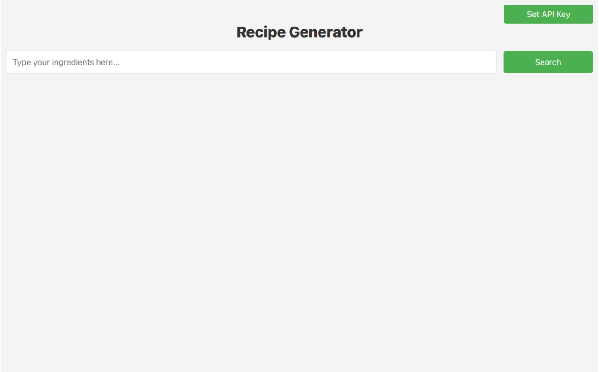

# Recipe Generator App

This web application generates recipes based on user-provided ingredients. By leveraging OpenAI, it offers personalized recipe suggestions, making cooking more accessible and inspiring.

## Application Access
<p align="center">
  
</p>

URL of Page: [Recipe Generator](https://recipe-generator-app-phi.vercel.app/)

## Features
- **Personalized Recipe Suggestions:** Input your ingredients and receive recipes tailored to what you have.
- **OpenAI Integration:** Utilizes OpenAI's powerful GPT model to generate recipes.
- **Simple User Interface:** Designed for ease of use, with a straightforward process for entering ingredients and receiving recipes.

## Getting Started

### Prerequisites
- An active [OpenAI API key](https://platform.openai.com/)
- Python 3.6 or higher
- Flask
- OpenAI

### Installation
1. Clone the repository:
   ```shell
   git clone https://github.com/AICrafter08/recipe_generator_app.git
   ```
2. Navigate to the project directory:
    ```shell
    cd Covid19-Slot-Checker
    ```

3.  Install dependencies:
    
    ```shell
    pip install -r requirements.txt
    ```
    
4.  Run the application:
    
    ```shell
    python app.py
    ```

### Usage

1.  **Initial Setup:** The app is a web application accessible via a browser.
2.  **Set OpenAI Key:** Use the 'Update Key' option in the UI to input your OpenAI API key.
3.  **Enter Ingredients:** Type the ingredients you have into the provided field.
4.  **Generate Recipes:** Press enter, and our bot will suggest the best recipe in a simple, easy-to-follow manner.

Contributing
------------

Feel free to contribute, report issues, or provide suggestions for improvement. Contributions are always welcome!